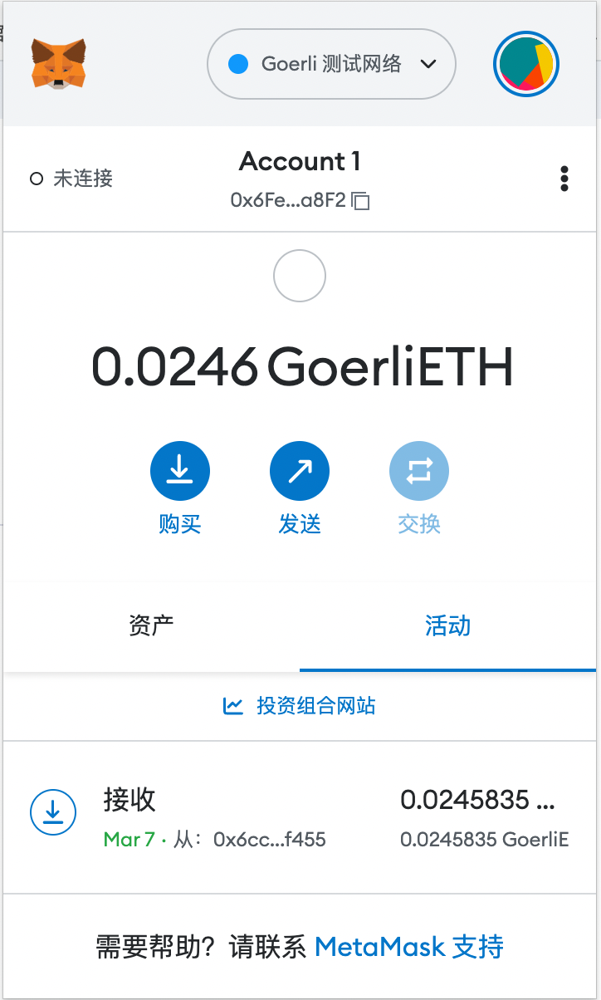
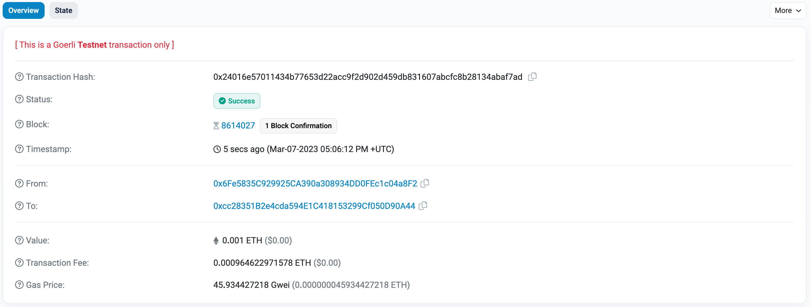
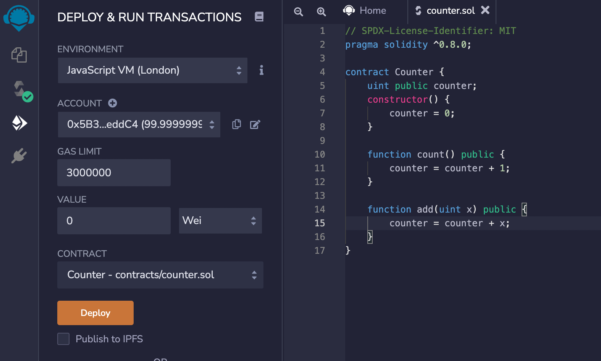
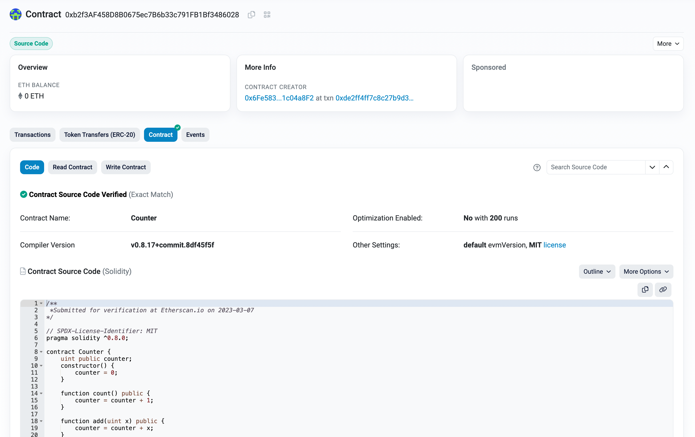
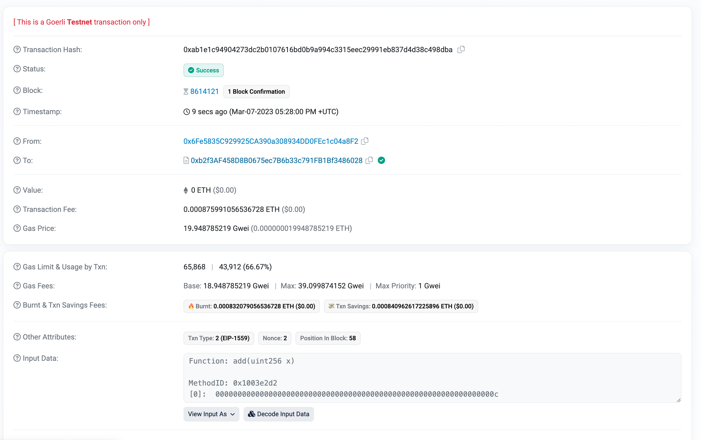

# Week 1 Course 1
## 安装Metamask

## 转账

交易哈希：0x24016e57011434b77653d22acc9f2d902d459db831607abcfc8b28134abaf7ad

在区块链浏览器上查看：https://goerli.etherscan.io/tx/0x24016e57011434b77653d22acc9f2d902d459db831607abcfc8b28134abaf7ad

## Counter合约

合约部署交易：https://goerli.etherscan.io/tx/0xde2ff4ff7c8c27b9d36272ecb5105b03ccb738c33f40b46c21bcc8fae78a65d5

合约地址：0xb2f3AF458D8B0675ec7B6b33c791FB1Bf3486028

区块链浏览器上查看：https://goerli.etherscan.io/address/0xb2f3AF458D8B0675ec7B6b33c791FB1Bf3486028#code

合约调用：https://goerli.etherscan.io/tx/0xab1e1c94904273dc2b0107616bd0b9a994c3315eec29991eb837d4d38c498dba
